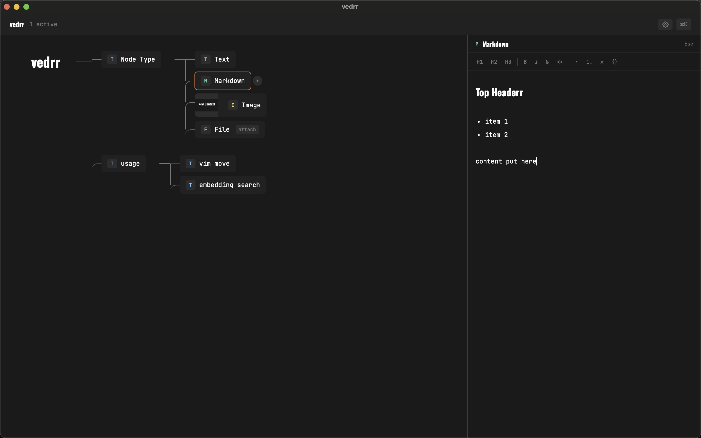
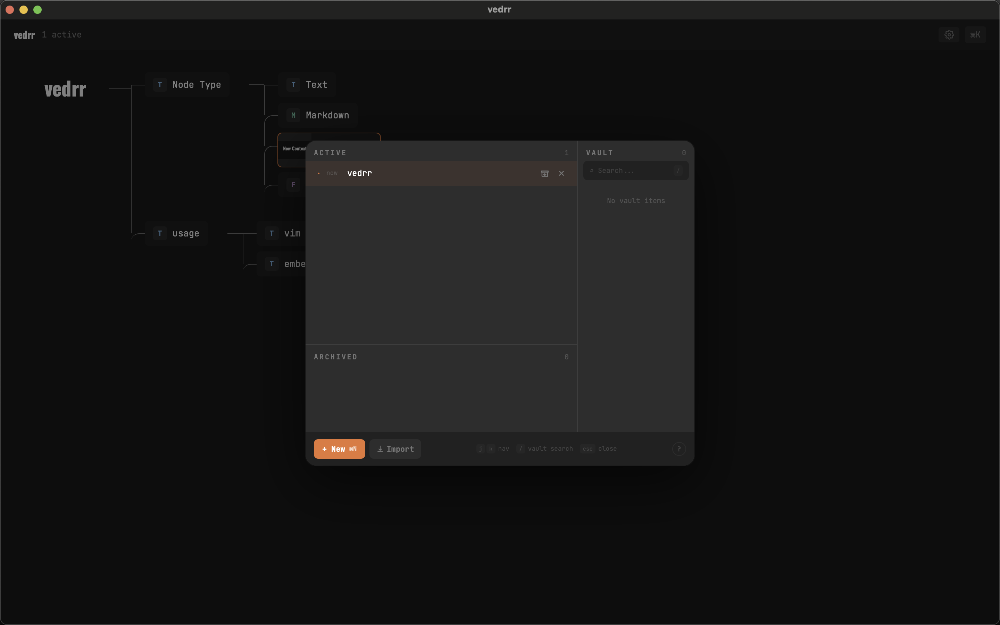

# vedrr

A keyboard-first desktop app for capturing thoughts as a tree — fast enough to keep up with your thinking.

Each topic lives in its own **context**, and every context is a horizontal tree you navigate with vim-style keys. Create nodes, rearrange branches, attach images or files, and switch between contexts instantly.


## Features

- **Horizontal tree** — visualize ideas as a left-to-right tree with curved connectors
- **Keyboard-first (vim-style)** — h/j/k/l navigation, no mouse required
- **Multiple node types** — Text, Markdown, Image, File
- **Markdown editor** — rich editing with a side panel
- **Quick Switcher** (`Cmd+K`) — create, search, switch, and archive contexts in one place
- **Context lifecycle** — Active / Archived / Vault states to keep your workspace clean
- **Paste anything** — `Ctrl+V` to paste text or images directly as nodes
- **Local-only** — all data stays on your machine, no cloud, no account

### Markdown Editor



### Quick Switcher



## Keyboard Shortcuts

| Key | Action |
|-----|--------|
| `j` / `k` | Next / previous sibling |
| `l` / `h` | First child / parent |
| `Enter` | Edit node title |
| `Tab` | Add child node |
| `Shift+Tab` | Add sibling node |
| `Delete` | Delete node |
| `t` | Change node type |
| `1`-`4` | Quick switch type (Text / Markdown / Image / File) |
| `Cmd+K` | Quick Switcher |
| `Ctrl+V` | Paste as node |
| `o` | Open / attach file |
| `Esc` | Close panel / cancel |

## Install

> Coming soon — pre-built binaries for macOS.

### Build from Source

Requires: [Node.js](https://nodejs.org/), [pnpm](https://pnpm.io/), [Rust](https://rustup.rs/)

```bash
git clone https://github.com/user/vedrr.git
cd vedrr
pnpm install
pnpm tauri build
```

The built app will be in `src-tauri/target/release/bundle/`.

## Development

```bash
pnpm tauri dev     # dev mode with hot reload
pnpm build         # frontend only
pnpm lint          # eslint
```

## Tech Stack

| Layer | Tech |
|-------|------|
| Desktop | Tauri 2 |
| Frontend | React 19, TypeScript, Vite, Zustand, Tailwind CSS v4 |
| Backend | Rust, SQLite |

## Data Storage

All data is stored locally:

- Database: `~/vedrr/data/vedrr.db`
- Files & images: `~/vedrr/files/`

No cloud. No account. Your data never leaves your machine.

## License

[GPL-3.0](LICENSE)
