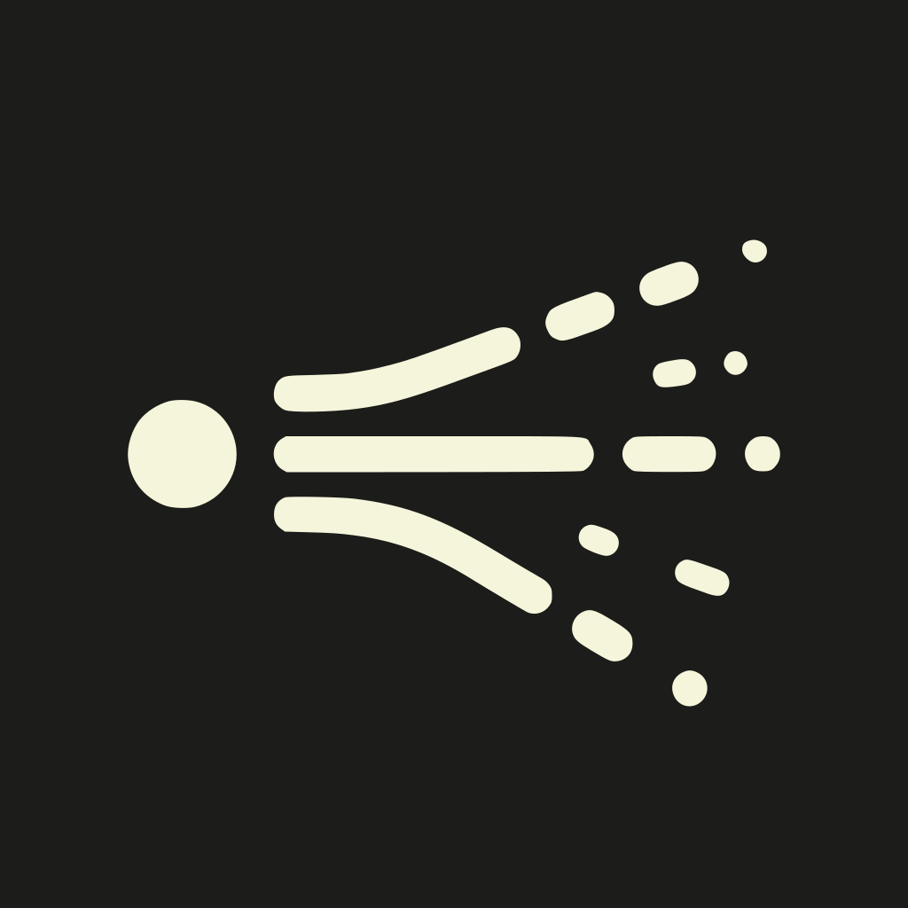
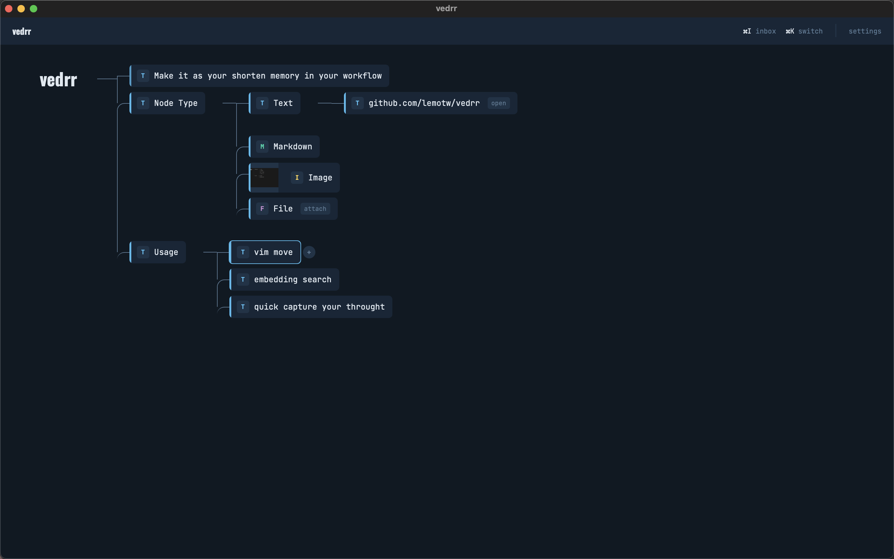
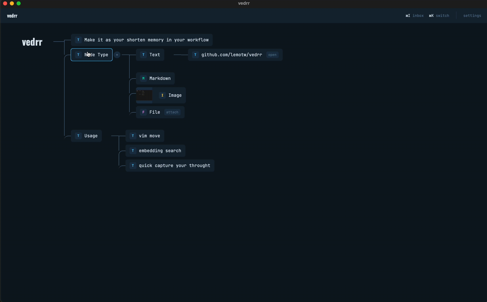
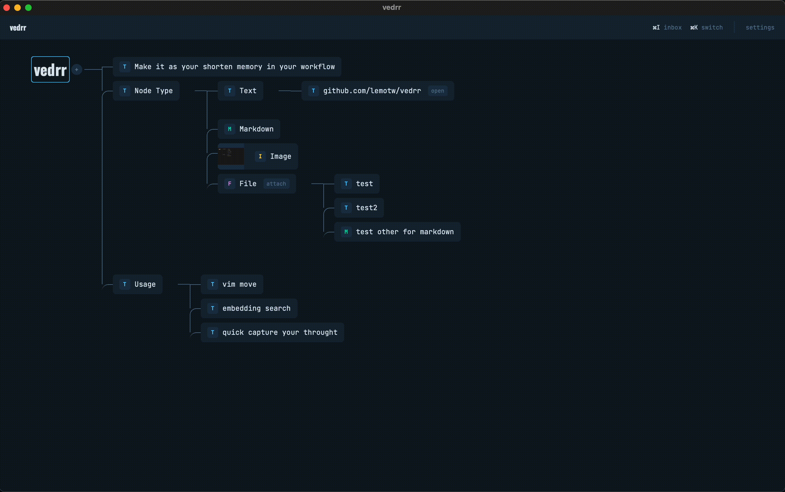

<p align="center">
  
</p>

<h1 align="center">vedrr</h1>

<p align="center">
  Keyboard-first desktop knowledge manager with horizontal tree maps and vim-style navigation.
</p>

<p align="center">
  <a href="LICENSE"></a>
  <a href="https://github.com/lemotw/vedrr/releases/latest"></a>
  
  <a href="https://tauri.app"></a>
  <a href="https://www.rust-lang.org"></a>
</p>

<p align="center">
  <a href="https://github.com/lemotw/vedrr/releases/latest/download/vedrr_aarch64.dmg">macOS (Apple Silicon)</a> ·
  <a href="https://github.com/lemotw/vedrr/releases/latest/download/vedrr_x64.dmg">macOS (Intel)</a> ·
  <a href="https://github.com/lemotw/vedrr/releases/latest/download/vedrr_amd64.deb">Linux (.deb)</a> ·
  <a href="https://github.com/lemotw/vedrr/releases/latest/download/vedrr_x64-setup.exe">Windows</a>
</p>

Each topic lives in its own **context**, and every context is a horizontal tree you navigate with `h/j/k/l`. Create nodes, rearrange branches, attach images or files, and switch between contexts instantly.



## Why vedrr

- **Tree-native** -- ideas are structured as horizontal trees, not flat documents or graphs. No plugins needed.
- **Keyboard-first** -- vim-style `h/j/k/l` navigation, `Tab` to create, `Enter` to edit. Your hands stay on the keyboard.
- **Local-only** -- all data stays in a local SQLite database. No cloud, no account, no telemetry, no network requests (unless you configure AI features).

## Features

### Node Editing

Create and edit nodes without leaving the keyboard — `Tab` to add, `Enter` to edit, type and done.



### Node Movement

Rearrange your tree with `Alt+h/j/k/l` — reparent, reorder, restructure ideas fluidly.



### Quick Capture & Search

Capture thoughts from anywhere with a global shortcut (default `Cmd+Shift+Space`, customizable), find any node instantly with `Cmd+F`.


### More

- **Multiple node types** -- Text, Markdown, Image, File
- **Markdown editor** -- rich side-panel editor (TipTap-based)
- **Quick Switcher** (`Cmd+K`) -- search, create, switch contexts instantly
- **Node Search** (`Cmd+F`) -- semantic search (local embedding model) or full-text search
- **Quick Capture** (`Cmd+Shift+Space`) -- global shortcut to capture thoughts from anywhere
- **AI Compact** -- right-click a subtree to reorganize it with AI
- **Export / Import** -- `.zip` or `.png` export, drag & drop import
- **Themes** -- 8 built-in themes + fully custom theme
- **i18n** -- Traditional Chinese and English

## Keyboard Shortcuts

| Key | Action |
|-----|--------|
| `j` / `k` | Next / previous sibling |
| `l` / `h` | First child / parent |
| `Alt+j/k` | Reorder among siblings |
| `Alt+l/h` | Reparent node |
| `Tab` / `Shift+Tab` | Add child / sibling |
| `Enter` | Edit node |
| `Delete` | Delete node |
| `z` | Collapse / expand subtree |
| `Cmd+K` | Quick Switcher |
| `Cmd+F` | Node Search |
| `Cmd+Shift+Space` | Quick Capture (global) |

## Install

Download the latest release for your platform:

**[Download from GitHub Releases](https://github.com/lemotw/vedrr/releases/latest)**

| Platform | Format |
|----------|--------|
| macOS (Apple Silicon) | `.dmg` |
| macOS (Intel) | `.dmg` |
| Linux | `.deb` |
| Windows | `.exe` (NSIS installer) |

### Build from Source

Requires: [Node.js](https://nodejs.org/), [pnpm](https://pnpm.io/), [Rust](https://rustup.rs/)

```bash
git clone https://github.com/lemotw/vedrr.git
cd vedrr
pnpm install
pnpm tauri build
```

The built app will be in `src-tauri/target/release/bundle/`.

## Development

```bash
pnpm tauri dev     # dev mode with hot reload
pnpm build         # frontend only
pnpm lint          # eslint
```

## Tech Stack

| Layer | Tech |
|-------|------|
| Desktop | Tauri 2 |
| Frontend | React 19, TypeScript, Vite 7, Zustand 5, Tailwind CSS v4, TipTap |
| Backend | Rust, SQLite (rusqlite, WAL mode) |
| Search | Local embedding model (multilingual-e5-small) for semantic search, full-text search |
| AI | Configurable LLM profiles (API key + model) for subtree compaction |
| Drag & Drop | dnd-kit |

## Data Storage

All data is stored locally:

- Database: `~/vedrr/data/vedrr.db`
- Files & images: `~/vedrr/files/`

No cloud. No account. No telemetry. Your data never leaves your machine.

## License

[GPL-3.0](LICENSE)
